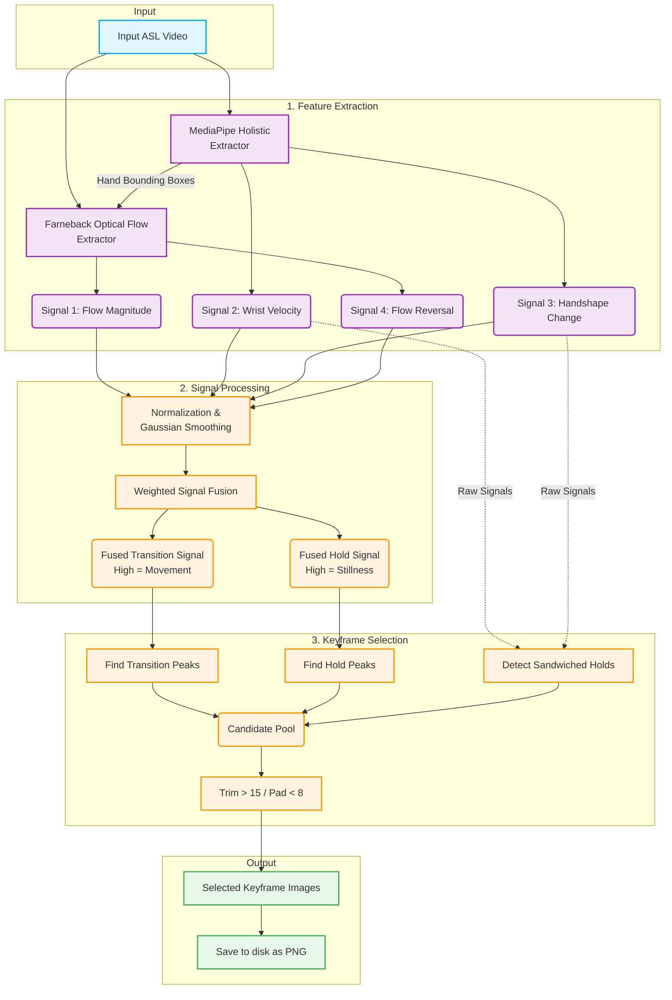

# Keyframe Extraction Pipeline

The Keyframe Extraction Pipeline is a specialized algorithm designed to extract 8 to 15 semantically meaningful frames from word-level American Sign Language (ASL) videos. 

Unlike traditional uniform frame sampling or simple motion-thresholding, this pipeline uses a **four-signal hybrid approach** combining skeletal landmarks and dense optical flow to capture both rapid transitions and subtle held poses that define signs.

---

## 🏗️ Architecture & Pipeline Overview



---

## ⚙️ Detailed Pipeline Steps

### Step 1: Video Loading
- **What it does:** Reads the raw video file and decodes all frames into memory (RGB `uint8` arrays). It also extracts the raw video Framerate (FPS).
- **Inputs:** Raw input video file path.
- **Why:** Full in-memory loading allows for bidirectional signal analysis and smoothing that cannot be performed in a live stream.

### Step 2: MediaPipe Landmark Sensing (Signals 2 & 3)
- **What it does:** Runs the Google MediaPipe Holistic model on every frame to detect body and hand landmarks.
    - **Signal 2 (Wrist Velocity):** Calculates the L2 displacement of wrist landmarks between consecutive frames.
    - **Signal 3 (Handshape Change):** Calculates the L2 displacement of all non-wrist finger joint landmarks between frames.
    - **Hand Bounding Boxes:** Extracts dynamic bounding boxes outlining the signer's hands.
- **Why:** Skeletal tracking is excellent at isolating micro-movements (like fingers spelling a letter) that global optical flow might miss against a noisy background.

### Step 3: Optical Flow Computation (Signals 1 & 4)
- **What it does:** Uses the dense Farneback Optical Flow algorithm on consecutive frame pairs, masked dynamically by the Hand Bounding Boxes from Step 2.
    - **Signal 1 (Flow Magnitude):** The mean motion energy specifically concentrated around the hands.
    - **Signal 4 (Flow Reversal):** Angular velocity tracking between frames to capture sudden changes in direction.
- **Why:** Optical flow captures macro-movements and motion blur physics better than skeletal tracking, which can sometimes drop tracking during fast, blurry sweeps. Masking it to the hands eliminates background noise (e.g., a moving head or background object).

### Step 4: Signal Fusion
- **What it does:** 
    1. Normalizes all four signals to a `[0, 1]` scale.
    2. Applies a 1D Gaussian Smoothing filter (`sigma=2.0`) to reduce jitter.
    3. Blends the signals using a weighted sum (`30%` Flow Mag, `15%` Flow Dir, `25%` Wrist Vel, `30%` Handshape).
    4. Produces two meta-signals:
        - `Fused Transition`: Peaks represent strong movement or handshape morphs.
        - `Fused Hold`: The inverse of motion, smoothed with a tighter window (`0.5x sigma`) to preserve brief moments of stillness.

### Step 5: Keyframe Selection Logic
- **What it does:** Selects the exact frame indices to keep using four complimentary strategies:
    1. **Transition Peaks:** Finds top peak intervals in the `Fused Transition` signal (captures motion onsets, apexes, and offsets).
    2. **Hold Peaks:** Finds top peak intervals in the `Fused Hold` signal (captures distinct, held rest-poses).
    3. **Sandwiched Hold Detection:** A custom algorithmic pass that looks at the raw unsmoothed signals to find "valleys" (brief pauses) sandwiched between two rapid motion bursts.
    4. **Padding & Trimming:** Ensures the final count is strictly between `[8, 15]` frames. If too many frames are selected, it drops the lowest-scoring middle frames first. If too few, it pads by adding the highest-scoring unselected background frames.
- **Why:** Sign language is composed of "Holds" (static poses) and "Movements" (transitions). Traditional temporal sub-sampling misses the distinct pauses. This multi-strategy approach ensures we capture the trajectory, the start/end bounds, *and* the brief static handshapes required to identify a word.

### Step 6: Frame Extraction and Output
- **What it does:** Slices the selected indices from the original video array in chronological order.
- **Format:** Saves the frames as individual, unstitched `.png` images.
- **Why `.png`:** Lossless compression prevents artifacts from interfering with the downstream Landmark extraction pipeline.

---

## 📁 Outputs & Folder Structure

The pipeline is designed to support both single-video processing and full-dataset batch processing. 

### Output Formats
Instead of returning stitched strips or arrays, the pipeline outputs **discrete image files**, numbered sequentially to preserve temporal order, regardless of their original frame index in the raw video. 

If the original video had 60 frames, and the algorithm selected frames `[5, 12, 14, 25, 40, 50, 58, 59]`, they will be written out sequentially as `frame_0.png` through `frame_7.png`.

### Directory Structure
When running in batch mode, outputs are strictly organized by their classification label and their unique video ID (`video_stem`).

```text
outputs/
└── keyframes/
    ├── brother/
    │   ├── brother_69251/
    │   │   ├── frame_0.png
    │   │   ├── frame_1.png
    │   │   ├── ...
    │   │   └── frame_11.png
    │   └── brother_12345/
    │       ├── frame_0.png
    │       └── ...
    ├── mother/
    │   └── mother_36929/
    │       ├── frame_0.png
    │       └── ...
    └── who/
        └── who_63229/
            ├── frame_0.png
            └── ...
```

### Downstream Integration
These individual `.png` frames act as the direct input to the **Landmark Extractor** phase of the wider Data Preparation Tool. Because they are saved sequentially, the Landmark Extractor does not need to know the original raw frame indices; it simply processes `0` through `N` and forwards a time-normalized spatial tensor to the RNN/BiLSTM classifier.
