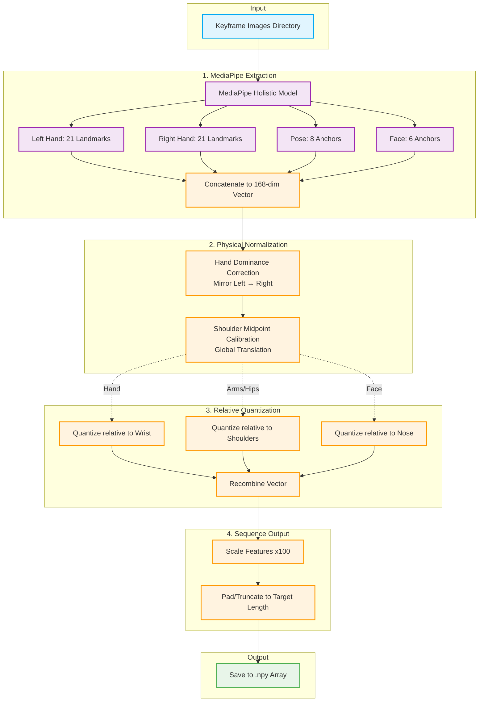

# Landmark Extraction Pipeline

The Landmark Extraction Pipeline is responsible for processing a sequence of keyframe images into a standardized, gradient-friendly, and mathematically robust numerical array `(Sequence_Length, 168)`.

This pipeline implements the **Relative Quantization (RQ)** approach from the reference BdSL research paper. Instead of feeding raw pixel coordinates directly into the RNN/BiLSTM classifier, it applies a 6-step physical normalization process that makes the data invariant to where the signer is standing or how large they appear in the frame.

---

## 🏗️ Architecture & Pipeline Overview



---

## ⚙️ Detailed Pipeline Steps

### Step 1: MediaPipe Selection (168 Features)
- **What it does:** Runs the Google MediaPipe Holistic model (`static_image_mode=True` for maximum accuracy per frame rather than tracking approximations) and plucks out exactly **56 specific physiological landmarks**, discarding the rest.
- **The 56 Landmarks (x, y, z = 168 features):**
    - **21 Left Hand** (all joints)
    - **21 Right Hand** (all joints)
    - **8 Pose Anchors** (Left/Right Shoulders, Elbows, Wrists, Hips)
    - **6 Face Anchors** (Nose, Forehead, Cheeks, Chin, Lip)
- **Why:** Full body landmark arrays contain unnecessary data (e.g., foot position, eye-gaze tracking) that adds noise to sign language classification. We strictly bottleneck the data to the effectors necessary for ASL.

### Step 2: Hand Dominance Correction
- **What it does:** Scans the sequence to detect which hand is dominant (by counting which hand had more successful MediaPipe detections). If the left hand is dominant, it *horizontally mirrors* the entire physiological structure so it appears right-handed.
- **How:** 
  1. Swaps the `[0:63]` and `[63:126]` memory slots.
  2. Swaps paired Pose joints (Left Shoulder ↔ Right Shoulder).
  3. Swaps paired Face joints (Left Cheek ↔ Right Cheek).
  4. Flips all active X-coordinates using `1.0 - x` **with a zero-guard** (preventing `1.0 - 0 = 1.0` artifacts on undetected limbs).
- **Why:** Consolidates the dataset. A BiLSTM does not need to learn a sign twice (once for left-handed signers, once for right-handed).

### Step 3: Shoulder Midpoint Calibration
- **What it does:** Calculates the geometric midpoint between the Left and Right shoulder in the **first frame** of the sequence. It then subtracts this midpoint from *every* coordinate in the entire sequence.
- **Why:** Converts coordinates from *Camera-Relative* (e.g., "The hand is at pixel 500") to *Body-Relative* (e.g., "The hand is 10 units in front of the chest"). This makes the data invariant to where the signer is standing in the video frame.

### Step 4: Relative Quantization (RQ)
- **What it does:** The core thesis of the pipeline. It localizes and discretizes specific body parts relative to their structural parent, rather than leaving them in global space.
    - **Hands:** Translated relative to their own Wrist, then quantized into grids of `(10, 10, 5)`.
    - **Limbs (Elbows/Wrists/Hips):** Translated relative to the moving Shoulder Midpoint, quantized to `(10, 10, 5)`.
    - **Face:** Translated relative to the Nose tip, quantized to `(5, 5, 3)`.
    - **Shoulders:** Left strictly untouched in global calibrated space (zero-anchored).
- **Why:** High-precision float coordinate jitter confuses recurrent neural networks. By aggressively discretizing (e.g., throwing a finger joint into one of 10 "buckets"), we force the neural network to learn macro-semantic handshapes rather than micro-pixel variations.

### Step 5: Feature Scaling
- **What it does:** Multiplies the entire array by a constant scalar (`x100.0`).
- **Why:** RQ produces tiny decimal values `[0.0, 1.0]`. Multiplying up to the `[0.0, 100.0]` range produces much steeper, healthier gradients during neural network Backpropagation.

### Step 6: Sequence Padding
- **What it does:** Enforces a strict temporal length (e.g., `target_sequence_length = 15`). 
    - If `frames > 15`: Truncates the tail.
    - If `frames < 15`: Zero-pads the tail.
- **Why:** RNN batch processing requires uniform tensor shapes.

---

## 📁 Outputs & Folder Structure

The pipeline is entirely agnostic to whether it is being fed dynamically extracted `Keyframes` or uniform `Raw Frames`. It simply requires a directory of images named numbered sequentially (`frame_0.png`, `frame_1.png`...).

### Output Formats
The output is a single strictly-shaped NumPy Binary file (`.npy`) containing a 2D `float64` array of shape `(Sequence_Length, 168)`.

### Directory Structure
When processing a dataset batch, the pipeline maintains the semantic label grouping, outputting one `.npy` file per video.

```text
outputs/
└── landmarks/                 <-- Root output dir
    ├── brother/               <-- Label subdirectory
    │   ├── brother_69251.npy  <-- Single output tensor
    │   └── brother_12345.npy
    ├── mother/
    │   └── mother_36929.npy
    └── who/
        └── who_63229.npy
```

These `.npy` files are the final, pure, mathematical state of the data, ready to be batched in PyTorch DataLoaders for Classifier training.
