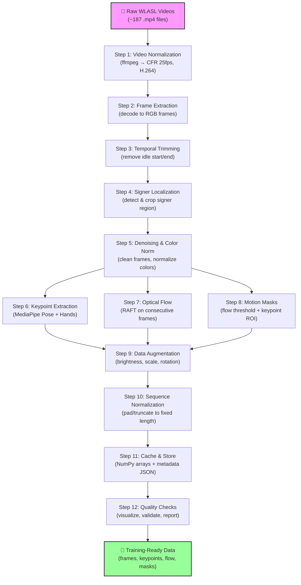
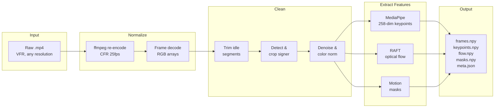
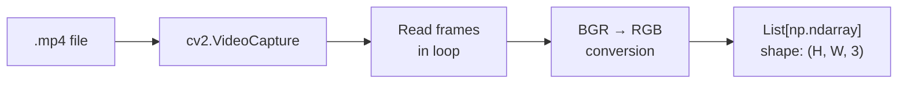
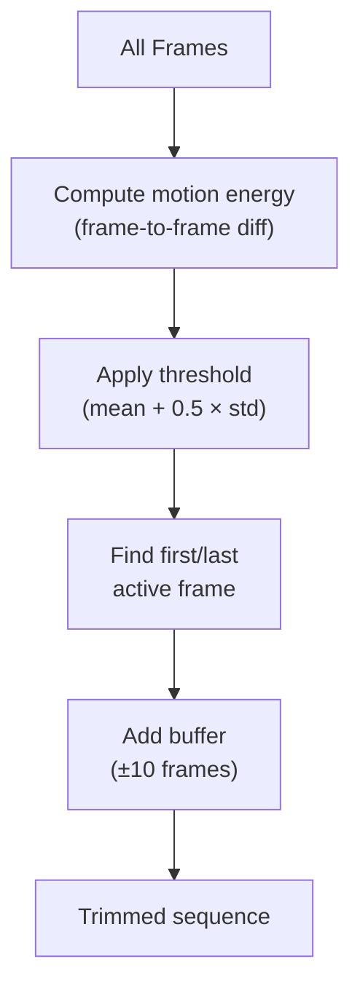
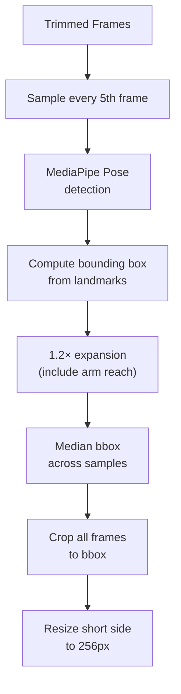
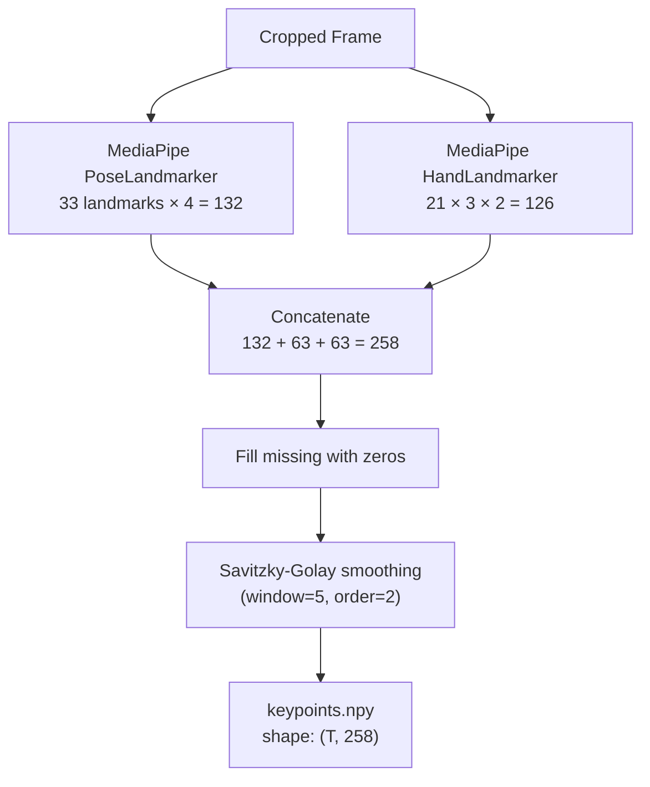
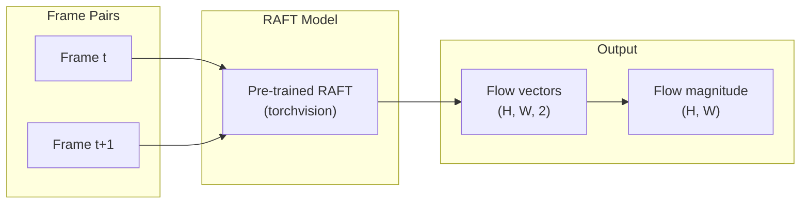
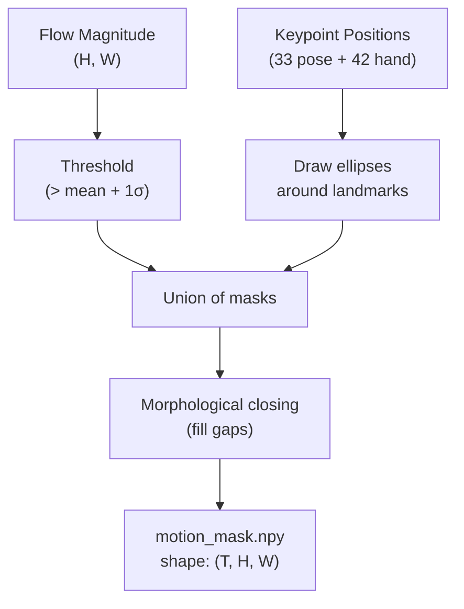
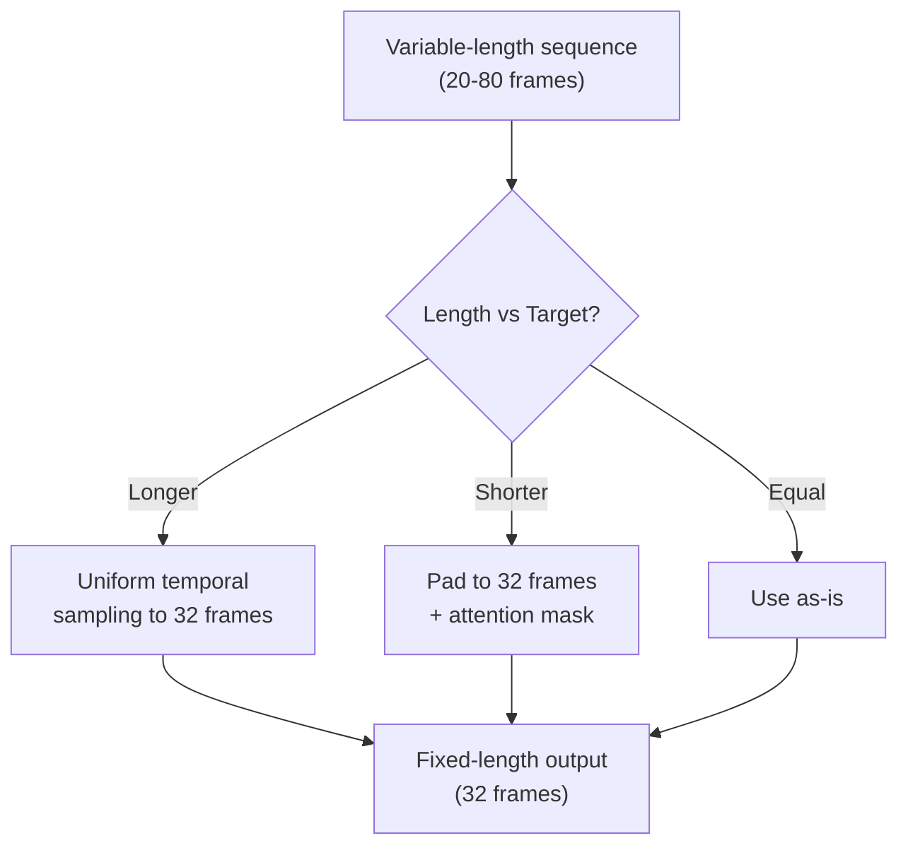
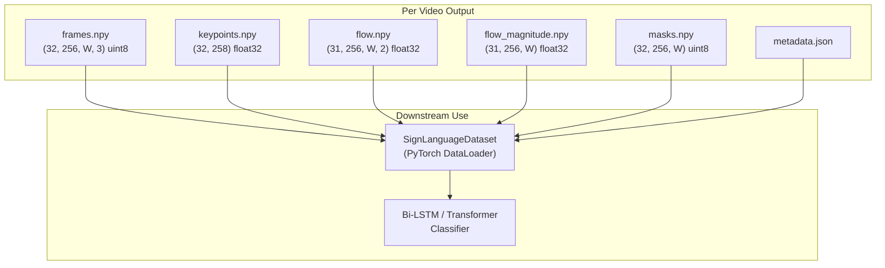

# Video Preprocessing Pipeline — Complete Technical Documentation

## Table of Contents

1. [Overview](#overview)
2. [Why Preprocessing Matters](#why-preprocessing-matters)
3. [Pipeline Architecture](#pipeline-architecture)
4. [Step-by-Step Pipeline](#step-by-step-pipeline)
   - [Step 1: Video Normalization](#step-1-video-normalization)
   - [Step 2: Frame Extraction](#step-2-frame-extraction)
   - [Step 3: Temporal Trimming](#step-3-temporal-trimming)
   - [Step 4: Signer Localization & Cropping](#step-4-signer-localization--cropping)
   - [Step 5: Denoising & Color Normalization](#step-5-denoising--color-normalization)
   - [Step 6: Keypoint / Pose Extraction](#step-6-keypoint--pose-extraction)
   - [Step 7: Optical Flow Computation (RAFT)](#step-7-optical-flow-computation-raft)
   - [Step 8: Background & Motion Masks](#step-8-background--motion-masks)
   - [Step 9: Data Augmentation](#step-9-data-augmentation)
   - [Step 10: Sequence Length Normalization](#step-10-sequence-length-normalization)
    - [Method D: Multimodal Fusion Keyframe Selection](#method-d-multimodal-fusion-keyframe-selection)
   - [Step 11: Caching & Storage](#step-11-caching--storage)
   - [Step 12: Quality Checks & Validation](#step-12-quality-checks--validation)
5. [Critical Warnings for Sign Language Data](#critical-warnings-for-sign-language-data)
6. [Pipeline Parameters Reference](#pipeline-parameters-reference)
7. [Output Format](#output-format)

---

## Overview

This document describes the **complete video preprocessing pipeline** for preparing raw WLASL (Word-Level American Sign Language) videos for keyframe extraction and downstream sign language recognition using deep learning (Bi-LSTM / Transformer).

The pipeline transforms raw, heterogeneous video files into clean, standardized, feature-rich data ready for model training. It operates on our dataset of **~187 videos across 15 ASL word classes**.

### Goal

> Take raw sign language videos of varying quality, resolution, frame rate, and duration → produce standardized sequences of cropped signer regions, pose keypoints, and optical flow features → feed into a recognition model.

---

## Why Preprocessing Matters

WLASL videos are crowd-sourced from the internet, which means:

| Problem | Impact | Solution |
|---------|--------|----------|
| **Variable frame rates** (15–60 fps) | Temporal inconsistency breaks motion analysis | Normalize to constant 25 fps |
| **Variable resolution** (240p–1080p) | Feature extraction behaves differently across scales | Resize to consistent short side 256px |
| **Variable duration** (0.5s–5s+) | Some signs are quick, others have long idle segments | Temporal trimming + fixed-length sequences |
| **Background clutter** | Camera motion, other people, noisy environments | Signer localization + background masking |
| **Compression artifacts** | Macro-blocking, ringing, noise | Mild denoising |
| **Different signers** | Body proportions, signing speed, signing style vary | Pose normalization + augmentation |
| **VFR (Variable Frame Rate)** | Dropped/duplicated frames corrupt optical flow | Re-encode to CFR with ffmpeg |

Without preprocessing, the model would learn to recognize video artifacts and background patterns instead of actual sign language gestures.

---

## Pipeline Architecture

### High-Level Flow



### Per-Video Processing Flow



---

## Step-by-Step Pipeline

### Step 1: Video Normalization

**What:** Re-encode all raw videos to a consistent format using ffmpeg.

**Why it's needed:**
- WLASL videos come from multiple sources with different codecs, frame rates, and container formats.
- **Variable Frame Rate (VFR)** is the biggest problem — many web videos have VFR, which means frames are not evenly spaced in time. This completely breaks optical flow computation (RAFT assumes constant time between frames).
- Different codecs may decode slightly differently across platforms.

**How:**
```bash
ffmpeg -i input.mp4 -r 25 -c:v libx264 -crf 20 -preset medium \
       -pix_fmt yuv420p -an -y output.mp4
```

**Parameters:**
| Parameter | Value | Rationale |
|-----------|-------|-----------|
| `-r 25` | 25 fps | Standard rate; fast enough for sign language motion. WLASL uses 25Hz. |
| `-c:v libx264` | H.264 codec | Universal compatibility, efficient compression |
| `-crf 20` | Quality factor | Near-lossless visual quality (18=visually lossless, 23=default). We use 20 as a good balance. |
| `-preset medium` | Encoding speed | Balance between speed and compression efficiency |
| `-pix_fmt yuv420p` | Pixel format | Standard for maximum compatibility |
| `-an` | No audio | Audio is irrelevant for visual sign recognition |

**Output:** All videos at exactly 25 fps CFR, H.264 encoded, consistent quality.

---

### Step 2: Frame Extraction

**What:** Decode normalized videos into individual RGB frame arrays.

**Why it's needed:**
- All downstream processing operates on individual frames or frame pairs.
- We need frames in memory as numpy arrays for OpenCV, MediaPipe, and PyTorch operations.

**How:**
- Use OpenCV `VideoCapture` to read frame-by-frame.
- Convert BGR (OpenCV default) → RGB.
- Store as list of numpy arrays `(H, W, 3)`, dtype `uint8`.

**Process flow:**


---

### Step 3: Temporal Trimming

**What:** Remove idle (motionless) segments at the beginning and end of each video.

**Why it's needed:**
- Many WLASL videos have the signer standing still before they begin signing and after they finish.
- These idle frames contain no useful information and waste sequence capacity.
- The sign's actual motion typically occupies only 30–70% of the total video duration.

**How:**
1. Compute a **motion energy curve**: for each frame, measure the absolute pixel difference from its neighbor.
2. Apply a threshold to determine which frames have "significant motion."
3. Find the first and last frames above the threshold — this is the **active signing window**.
4. Add a small buffer (0.2–0.5 seconds ≈ 5–12 frames at 25fps) on each side to avoid cutting into the sign.



**Example:**
```
Original:  [idle...idle...SIGN MOTION...idle...idle]
                       ↑ first_active       ↑ last_active
Trimmed:    [buffer][SIGN MOTION][buffer]
```

---

### Step 4: Signer Localization & Cropping

**What:** Detect the signer in each frame and crop to a tight bounding box around them.

**Why it's needed:**
- Videos have varying amounts of background, other people, and clutter.
- The model should focus on the signer's body and hands, not the background.
- Consistent framing reduces the variance the model must handle.
- Cropping also standardizes the effective resolution across all samples.

**How (Pose-Based Approach):**
1. Run MediaPipe Pose on a subset of frames (e.g., every 5th frame) to find body landmarks.
2. Compute a bounding box from shoulder, hip, and wrist landmarks with **1.2× expansion** to include full arm reach and some context.
3. Take the **median bounding box** across sampled frames (robust to single-frame errors).
4. Apply the same crop to all frames in the video.
5. Resize the cropped region so the short side is **256 pixels** (maintaining aspect ratio).



**Why 1.2× expansion:**
Sign language uses the space around the body — arms extend beyond shoulders, hands move above the head and below the waist. A tight crop would cut off critical information. The 1.2× factor ensures we capture the full **signing space** without excessive background.

**Fallback:** If pose detection fails (signer not detected), fall back to center-cropping the frame to a 4:3 or 1:1 aspect ratio.

---

### Step 5: Denoising & Color Normalization

**What:** Clean up compression artifacts and standardize color representation.

**Why it's needed:**
- Web videos often have compression artifacts (macro-blocking, ringing) that create false edges and textures.
- Different cameras and lighting produce different color distributions.
- Consistent input helps both traditional CV (optical flow) and deep learning models.

**How:**

**Denoising (mild):**
- Apply `cv2.fastNlMeansDenoisingColored(frame, h=6, hForColorComponents=6)` — a non-local means denoising filter that preserves edges while removing random noise.
- `h=6` is intentionally mild; we do NOT want to blur hand details.

**Color Normalization:**
- Convert to float32, scale to [0.0, 1.0] range.
- For frames that will feed into pretrained backbones (RAFT, etc.), apply ImageNet normalization:
  - mean = [0.485, 0.456, 0.406]
  - std = [0.229, 0.224, 0.225]

---

### Step 6: Keypoint / Pose Extraction

**What:** Extract body pose and hand landmarks from each cropped frame using MediaPipe.

**Why it's needed:**
- Keypoints are the **primary feature representation** for sign language recognition.
- They encode body pose, hand shape, and hand position in a compact 258-dimensional vector.
- Keypoints are invariant to appearance (skin color, clothing) and focus purely on body geometry.

**How:**
1. Run **MediaPipe PoseLandmarker** → 33 body landmarks × 4 values (x, y, z, visibility) = 132 features.
2. Run **MediaPipe HandLandmarker** → 21 landmarks × 3 values (x, y, z) per hand = 63 × 2 = 126 features.
3. Concatenate: 132 + 63 + 63 = **258 features per frame**.
4. Missing landmarks (hand not visible) are filled with zeros.
5. Apply **Savitzky-Golay smoothing** (window=5–11 frames, poly order=2) to remove jitter in the temporal dimension.
6. Normalize coordinates relative to the crop region.



**Feature vector layout:**
```
[pose_0_x, pose_0_y, pose_0_z, pose_0_vis, ..., pose_32_vis,  ← 132 values
 lhand_0_x, lhand_0_y, lhand_0_z, ..., lhand_20_z,            ← 63 values
 rhand_0_x, rhand_0_y, rhand_0_z, ..., rhand_20_z]            ← 63 values
```

---

### Step 7: Optical Flow Computation (RAFT)

**What:** Compute dense optical flow between consecutive frames using the RAFT deep learning model.

**Why it's needed:**
- Optical flow explicitly captures **motion** — the direction and speed of every pixel between frames.
- Sign language is inherently temporal; the motion trajectory of hands and body is what distinguishes signs.
- RAFT (Recurrent All-pairs Field Transforms) is the state-of-the-art optical flow model, far more accurate than classical methods (Farneback, Lucas-Kanade).
- Flow features complement keypoints: keypoints capture *where* body parts are, flow captures *how they move*.

**How:**
1. Take consecutive pairs of cropped, denoised frames.
2. Resize to RAFT input resolution (short side 256–384px).
3. Run pre-trained RAFT model (small variant for speed) on GPU/MPS.
4. Output: dense flow field of shape `(H, W, 2)` — horizontal (u) and vertical (v) displacement per pixel.
5. Compute flow magnitude: `mag = sqrt(u² + v²)` and angle: `angle = atan2(v, u)`.
6. Save both raw flow vectors and magnitude maps.



**Parameters:**
| Parameter | Value | Rationale |
|-----------|-------|-----------|
| Model size | `raft_small` | Good accuracy/speed tradeoff for our dataset size |
| Input resolution | Match cropped frame size | No additional resize needed |
| Batch size | 4–8 pairs | GPU memory dependent |
| Iterations | 12 (default) | RAFT refinement iterations; 12 is the standard |

---

### Step 8: Background & Motion Masks

**What:** Generate binary masks that highlight the signer's body and moving regions, suppressing background.

**Why it's needed:**
- Even after cropping, some background remains visible.
- Motion masks help the model focus attention on the signer rather than background motion (e.g., other people walking by).
- Combining optical flow thresholds with keypoint regions creates a robust signer-focused mask.

**How:**
1. **Flow-based mask:** Threshold the optical flow magnitude — pixels with flow above a threshold are marked as "moving."
2. **Keypoint-based mask:** Create elliptical regions around detected body and hand landmarks.
3. **Combined mask:** Union of flow mask and keypoint mask, then morphological closing (fill small gaps).



---

### Step 9: Data Augmentation

**What:** Apply random transformations during training to increase data diversity.

**Why it's needed:**
- Our dataset is small (~187 videos, ~12 per class) — augmentation prevents overfitting.
- Sign language videos vary in lighting, scale, and signer position; augmentation simulates this.

**Safe augmentations for sign language:**
| Augmentation | Range | Notes |
|-------------|-------|-------|
| Brightness/contrast | ±20% | Simulates different lighting |
| Small scale jitter | 0.9–1.1× | Simulates distance variation |
| Small rotation | ±5° | Simulates slight camera tilt |
| Random crop (within bbox) | 90–100% of crop | Simulates framing variation |
| Temporal jitter | ±1 frame | Skip/repeat single frames randomly |
| Gaussian noise | σ=0.01 | Robustness to sensor noise |

**⚠️ FORBIDDEN augmentations:**
| Augmentation | Why Forbidden |
|-------------|---------------|
| **Horizontal flip** | **Changes handedness — many signs have different meanings with left vs right hand. Some signs are directional (e.g., "go" vs "come").** |
| Large rotation (>10°) | Distorts spatial relationships critical for sign meaning |
| Color channel shuffle | Breaks pre-trained model assumptions |

---

### Step 10: Sequence Length Normalization

**What:** Ensure all samples have the same number of frames for batched training.

**Why it's needed:**
- Neural networks expect fixed-size inputs within a batch.
- Videos vary in length even after trimming (some signs are faster than others).
- We need a consistent temporal dimension.

**How:**
- **Target length:** 32 frames (configurable; 32–64 is typical for sign language).
- **If video is longer:** Select 32 frames using uniform temporal sampling (preserves the temporal distribution).
- **If video is shorter:** Pad with repeated last-frame or zeros, and generate an **attention mask** indicating which frames are real vs padded.



---

### Method D: Multimodal Fusion Keyframe Selection

**Status:** Recommended final approach for keyframe extraction.

**What:**
Selects keyframes by combining motion, pose dynamics, and appearance descriptors, then clustering and selecting medoids with temporal and quality constraints.

**Descriptor construction (`frame_descriptors.npy` concept):**
- `flow_scalar`: per-frame optical flow magnitude summary.
- `pose_features`: arm angles, wrist/hand velocities, and hand-distance geometry.
- `embedding_pca`: compact frame appearance embedding reduced by PCA.

Final descriptor per frame:

$$
	ext{descriptor}_t = [\text{flow\_scalar}_t \;||\; \text{pose\_features}_t \;||\; \text{embedding\_pca}_t]
$$

**Selection procedure:**
1. Normalize descriptors and reduce dimensionality (PCA; UMAP can be used as an alternative).
2. Cluster reduced descriptors with `k = target_keyframes` (k-means; spectral fallback).
3. Pick one medoid per cluster (closest member to cluster center).
4. Enforce temporal diversity if selected frames collapse into one time region.
5. Add endpoint bias so near-start and near-end frames are represented.
6. Final quality filter drops frames with:
    - low hand-keypoint confidence
    - very small hand crop coverage
7. Refill to target count with best remaining candidates if filtering removes too many frames.

**Why this is robust:**
- Captures both dynamic and static sign information.
- Preserves timeline coverage (important for sign onset/hold/release phases).
- Avoids selecting visually redundant high-motion bursts only.

---

### Step 11: Caching & Storage

**What:** Save preprocessed data efficiently for fast loading during training.

**Why it's needed:**
- Preprocessing is expensive (RAFT, MediaPipe); we do it once and cache results.
- Training loops need fast random access to samples.
- Metadata must be preserved for reproducibility.

**Storage format (per video):**
```
preprocessed/
├── {class_name}/
│   ├── {video_name}/
│   │   ├── frames.npy           # (T, H, W, 3) uint8 — cropped frames
│   │   ├── keypoints.npy        # (T, 258) float32 — pose + hand landmarks
│   │   ├── flow.npy             # (T-1, H, W, 2) float32 — optical flow vectors
│   │   ├── flow_magnitude.npy   # (T-1, H, W) float32 — flow magnitude maps
│   │   ├── masks.npy            # (T, H, W) uint8 — motion/signer masks
│   │   └── metadata.json        # processing parameters, stats, timestamps
```

**metadata.json example:**
```json
{
  "source_video": "who_63229.mp4",
  "label": "who",
  "original_fps": 30,
  "normalized_fps": 25,
  "original_frame_count": 150,
  "trimmed_frame_count": 87,
  "crop_bbox": [120, 50, 400, 480],
  "crop_size": [256, 320],
  "keypoint_confidence_mean": 0.82,
  "processing_timestamp": "2026-03-12T10:00:00",
  "pipeline_version": "1.0.0"
}
```

---

### Step 12: Quality Checks & Validation

**What:** Automated and visual checks to verify preprocessing quality.

**Why it's needed:**
- Bad preprocessing propagates errors to the model — garbage in, garbage out.
- Some videos may fail specific steps (no signer detected, corrupt file, etc.).
- We need confidence that the pipeline output is correct before training.

**Checks:**

| Check | Method | Pass Criteria |
|-------|--------|---------------|
| **Keypoint confidence** | Mean visibility score across all landmarks | > 0.5 for pose, > 0.3 for hands |
| **Flow magnitude range** | Min/max/mean of flow magnitude | Mean > 0.5px (some motion exists) |
| **Crop coverage** | Ratio of crop area to original frame | > 10% (signer is visible) |
| **Sequence length** | Number of trimmed frames | > 10 frames (sign is not too short) |
| **Feature distribution** | Histogram of keypoint values | No extreme outliers (> 5σ from mean) |

**Visualization outputs:**
- Annotated frames with keypoint skeleton overlay
- Optical flow color wheels (hue=direction, brightness=magnitude)
- Motion energy curves with trimming boundaries marked
- Per-class sample count report

---

## Critical Warnings for Sign Language Data

These are domain-specific constraints that MUST be respected:

### 1. Never Horizontally Flip
> **Horizontal flipping changes the meaning of signs.** Many ASL signs are hand-specific (right-hand dominant) or directional. Flipping would create incorrectly labeled data.

### 2. Don't Over-Crop
> **Keep torso context.** Many signs involve the relationship between hands and body (e.g., signs near the face vs chest). Cropping too tightly to just the hands loses this spatial context.

### 3. Don't Over-Stabilize
> **Signer body sway is informative.** Some signs involve deliberate body movement (leaning, head tilts). Aggressive camera stabilization would remove these signals.

### 4. Don't Over-Denoise
> **Hand edge details matter.** Aggressive denoising blurs finger edges, making handshape recognition harder. Use mild settings only.

### 5. Optical Flow is Not Everything
> **Static handshapes and facial expressions carry meaning.** Not all sign information is in the motion — hand configuration (handshape) at rest positions is equally important. The pipeline extracts both keypoints (static) and flow (dynamic) for this reason.

---

## Pipeline Parameters Reference

| Parameter | Default | Range | Description |
|-----------|---------|-------|-------------|
| `target_fps` | 25 | 15–30 | Output frame rate |
| `crf_quality` | 20 | 18–23 | ffmpeg CRF (lower = better quality) |
| `crop_expansion` | 1.2 | 1.1–1.5 | Bounding box expansion factor |
| `crop_short_side` | 256 | 224–384 | Short side of cropped frames in pixels |
| `denoise_h` | 6 | 3–10 | Denoising filter strength |
| `trim_buffer_frames` | 10 | 5–15 | Frames to keep before/after active segment |
| `trim_threshold_factor` | 0.5 | 0.3–1.0 | Motion threshold: mean + factor × std |
| `keypoint_smooth_window` | 5 | 3–11 | Savitzky-Golay smoothing window (must be odd) |
| `keypoint_smooth_order` | 2 | 1–3 | Savitzky-Golay polynomial order |
| `target_sequence_length` | 32 | 16–64 | Fixed output sequence length |
| `flow_model` | `raft_small` | small/large | RAFT model variant |
| `mask_threshold_sigma` | 1.0 | 0.5–2.0 | Flow threshold for motion mask (mean + σ × std) |
| `augment_brightness` | 0.2 | 0.0–0.3 | Max brightness change factor |
| `augment_rotation` | 5 | 0–10 | Max rotation in degrees |
| `augment_scale` | [0.9, 1.1] | – | Scale jitter range |

---

## Output Format

After the pipeline completes, each video produces the following artifacts:



The `SignLanguageDataset` in `model/dataset.py` loads these artifacts and serves them to the classifier during training. Keypoints (258-dim) and flow features are the primary inputs; frames and masks are used for visualization and attention weighting respectively.
