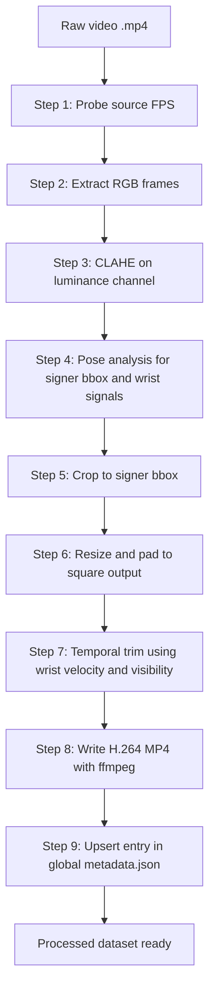
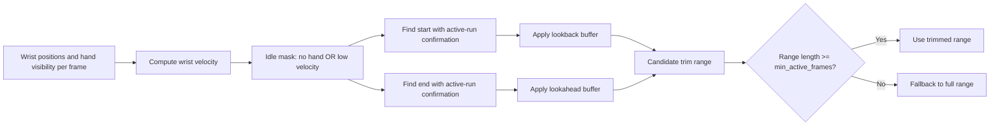
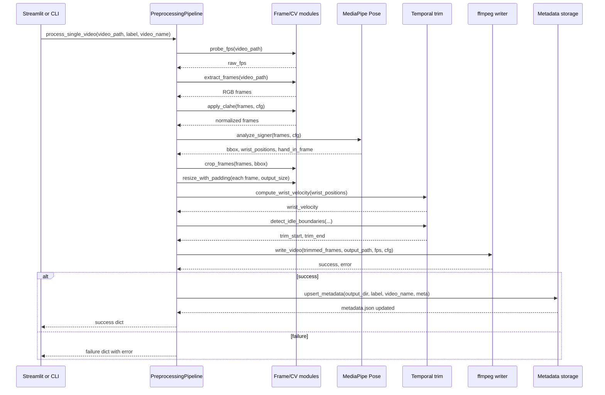

# Preprocessing Pipeline v2.0.0

## 1) Purpose and Scope

This document describes the current preprocessing pipeline implemented under `app/preprocessing/`.

The pipeline converts raw sign-language videos into:

1. A cleaned, trimmed, model-ready MP4 per sample.
2. A single global `metadata.json` file containing processing metadata for all processed samples.

It is designed for consistency across variable raw videos (different resolutions, lighting, framing, and idle lead-in/lead-out behavior).

Primary code entry points:

- Orchestration: `app/preprocessing/runner.py`
- Configuration: `app/preprocessing/config.py`
- CLI: `app/preprocessing/__main__.py`

---

## 2) High-Level Pipeline

### 2.1 End-to-end flow



### 2.2 Single-video processing contract

`PreprocessingPipeline.process_single_video(...)` returns a dictionary.

- Success path: `{ "success": True, "skipped": False, ...metadata fields... }`
- Skip path: `{ "success": True, "skipped": True, "label": ..., "video_name": ... }`
- Failure path: `{ "success": False, "label": ..., "video_name": ..., "error": ... }`

---

## 3) Pipeline Steps in Detail

This section explains each step with:

- What it is
- Why it exists
- Inputs
- How it works
- Outputs

## Step 1: Source FPS probe

File: `app/preprocessing/frame_extraction.py` (`probe_fps`)

### What
Reads the source video FPS using OpenCV metadata.

### Why
Keeps a record of original frame timing in metadata for traceability and diagnostics.

### Inputs
- `video_path: Path`

### How
- OpenCV `VideoCapture` reads `CAP_PROP_FPS`.
- If invalid, stores `0.0`.

### Outputs
- `raw_fps: float`

Notes:
- In the current runner implementation, this step probes FPS only.
- The pipeline does not currently call `normalize_video(...)` before frame extraction.
- `video_normalizer.py` exists and can be used independently or integrated later.

---

## Step 2: Frame extraction

File: `app/preprocessing/frame_extraction.py` (`extract_frames`)

### What
Decodes the video into an in-memory frame list.

### Why
All downstream algorithms (CLAHE, pose analysis, trimming, encoding) operate on frame arrays.

### Inputs
- `video_path: Path`

### How
- OpenCV decodes frame-by-frame.
- Each frame is converted BGR -> RGB.

### Outputs
- `frames: list[np.ndarray]`
- Shape per frame: `(H, W, 3)`
- Type: `uint8`

---

## Step 3: CLAHE normalization

File: `app/preprocessing/clahe.py` (`apply_clahe`)

### What
Applies Contrast Limited Adaptive Histogram Equalization (CLAHE) to luminance.

### Why
Stabilizes lighting across videos and improves robustness of pose detection and downstream consistency.

### Inputs
- `frames: list[np.ndarray]` in RGB
- `cfg.clahe_clip_limit` (default `2.0`)
- `cfg.clahe_tile_size` (default `(8, 8)`)

### How
For each frame:

1. RGB -> BGR
2. BGR -> LAB
3. Apply CLAHE to channel `L`
4. LAB -> BGR -> RGB

Only luminance is enhanced, preserving color relationships.

### Outputs
- CLAHE-adjusted RGB frame list (same length and dtype)

---

## Step 4: Signer analysis (bbox + trim signals)

File: `app/preprocessing/signer_crop.py` (`analyze_signer`)

### What
Runs MediaPipe Pose on each frame to derive:

1. A stable signer crop bounding box.
2. Per-frame wrist coordinates and visibility signals for temporal trimming.

### Why
- Localizes signer consistently for spatial normalization.
- Reuses the same pose pass to collect trim signals, avoiding extra model passes.

### Inputs
- CLAHE frames (RGB)
- `cfg.crop_expansion` (default `1.3`)

### How
- Uses MediaPipe `PoseLandmarker` in IMAGE mode.
- Uses pose landmarks `[0, 11, 12, 13, 14, 15, 16, 23, 24]` for bbox candidates.
- Collects per-frame wrists:
  - left wrist index `15`
  - right wrist index `16`
- Visibility threshold for hand-in-frame signal: `> 0.3`.
- Stable bbox is median of per-frame detected boxes, then expanded and clamped.
- Fallback (if no detections): center 80 percent crop.

### Outputs
- `bbox: (x1, y1, x2, y2)` in original frame pixels
- `wrist_positions: np.ndarray` shape `(T, 4)` with `[lx, ly, rx, ry]` in normalized coordinates
- `hand_in_frame: np.ndarray` shape `(T,)` bool

---

## Step 5: Crop to signer

File: `app/preprocessing/signer_crop.py` (`crop_frames`)

### What
Crops each frame to the computed signer bounding box.

### Why
Reduces irrelevant background and standardizes the spatial focus around signer motion.

### Inputs
- `frames`
- `bbox`

### How
- Slices each frame with `frame[y1:y2, x1:x2]`.

### Outputs
- Cropped frame list
- Runner records crop dimensions in metadata (`crop_size`).

---

## Step 6: Resize + pad to fixed square

File: `app/preprocessing/video_writer.py` (`resize_with_padding`)

### What
Converts each cropped frame to a fixed square size (default `512x512`) without distortion.

### Why
Models and tooling work better with a uniform spatial shape.
Preserving aspect ratio avoids geometry distortion.

### Inputs
- Cropped frames
- `cfg.output_size` (default `512`)

### How
For each frame:

1. Compute scale so max(H, W) becomes target.
2. Resize with `cv2.INTER_AREA`.
3. Place resized frame in center of black square canvas.

### Outputs
- Frame list with exact shape `(output_size, output_size, 3)`

---

## Step 7: Temporal trimming (dual signal)

Files:

- `app/preprocessing/temporal_trim.py` (`compute_wrist_velocity`)
- `app/preprocessing/temporal_trim.py` (`detect_idle_boundaries`)

### What
Removes likely idle frames at sequence head and tail.

### Why
Raw clips often contain non-signing idle periods before/after active signing.
Trimming improves signal-to-noise and temporal consistency.

### Inputs
- `wrist_positions` from step 4
- `hand_in_frame` from step 4
- `cfg.target_fps` (used for duration gate)
- `cfg.trim_vel_threshold` (default `0.008`)
- `cfg.trim_min_idle_duration` (default `0.4` sec)
- `cfg.min_active_frames` (default `10`)

### How
1. Compute per-frame wrist velocity as max displacement of left/right wrist from previous frame.
2. Mark frame idle if:
   - no wrist visible (`not hand_in_frame[i]`), OR
   - wrist velocity below threshold.
3. Find active start and active end requiring at least 3 nearby active frames.
4. Apply 2-frame buffer on both sides.
5. Safety fallback: if trimmed length < `min_active_frames`, keep full range.

### Outputs
- `trim_start`, `trim_end` inclusive indices
- Trimmed frame list

### Trimming logic diagram



---

## Step 8: Video write (H.264 MP4)

File: `app/preprocessing/video_writer.py` (`write_video`)

### What
Encodes trimmed RGB frames into an MP4 using ffmpeg through stdin piping.

### Why
- Efficient streaming write without temporary image dumps.
- Produces standard H.264 output suitable for downstream viewing/inference.

### Inputs
- `frames` (uniform shape RGB uint8)
- `output_path`
- `fps` (runner passes `cfg.target_fps`)
- `cfg.crf_quality` (default `20`)
- `cfg.ffmpeg_preset` (default `medium`)

### How
- Builds ffmpeg command using rawvideo stdin (`rgb24`).
- Encodes with `libx264`, `yuv420p`, no audio.
- Uses constrained ffmpeg logging (`-loglevel error`, `-nostats`).
- Validates file existence and non-zero size after encoding.

### Outputs
- Return tuple: `(success: bool, error_message: str | None)`
- On success, output video at:
  - `outputs/preprocessed/<label>/<video_stem>.mp4`

---

## Step 9: Metadata upsert

File: `app/preprocessing/storage.py` (`upsert_metadata`)

### What
Updates one global JSON metadata file for all processed videos.

### Why
Centralized index is easier to query/report than per-sample metadata fragments.

### Inputs
- `output_dir`
- `label`
- `video_name`
- metadata dictionary from runner

### How
- Load existing `metadata.json` if present, else `{}`.
- Insert or overwrite `metadata[label][video_stem]`.
- Write formatted JSON back to disk.

### Outputs
- File: `outputs/preprocessed/metadata.json`

---

## 4) Metadata Schema

Current per-video metadata fields (written by runner):

- `source_video: str`
- `label: str`
- `raw_fps: float`
- `output_fps: int`
- `original_frame_count: int`
- `trimmed_frame_count: int`
- `trim_range: [int, int]` (inclusive)
- `crop_bbox: [int, int, int, int]` (`x1, y1, x2, y2`)
- `crop_size: [int, int]` (`width, height` as currently recorded)
- `output_size: [int, int]`
- `pipeline_version: str` (currently `2.0.0`)
- `processing_timestamp: str` (ISO-8601 UTC)

Example:

```json
{
  "who": {
    "who_63229": {
      "source_video": "who_63229.mp4",
      "label": "who",
      "raw_fps": 23.976,
      "output_fps": 30,
      "original_frame_count": 47,
      "trimmed_frame_count": 45,
      "trim_range": [2, 46],
      "crop_bbox": [679, 197, 1451, 1080],
      "crop_size": [772, 883],
      "output_size": [512, 512],
      "pipeline_version": "2.0.0",
      "processing_timestamp": "2026-03-17T09:23:51.617877+00:00"
    }
  }
}
```

---

## 5) Output Layout

### 5.1 Directory structure

```text
outputs/
  preprocessed/
    metadata.json
    brother/
      brother_07932.mp4
      ...
    who/
      who_63229.mp4
      ...
    yes/
      yes_12345.mp4
      ...
```

### 5.2 File formats

- Processed sample:
  - Container: MP4
  - Video codec: H.264 (`libx264`)
  - Pixel format: `yuv420p`
  - Resolution: fixed square (`output_size x output_size`)
  - Audio: removed
- Metadata:
  - UTF-8 JSON
  - Global dictionary keyed by label then video stem

---

## 6) Quality Checks and Reporting

File: `app/preprocessing/quality_checks.py`

`check_sample(...)` validates:

1. Output MP4 exists.
2. OpenCV can open it.
3. Frame count >= `min_frames` (default `10`).

`generate_dataset_report(...)`:

- Loads `metadata.json`.
- Runs `check_sample(...)` for each metadata entry.
- Returns a list of `SampleReport` objects.

Report fields:

- `label`
- `video_name`
- `passed`
- `warnings[]`
- `trimmed_frames`
- `output_frames`

---

## 7) Batch and CLI Operation

CLI entry point: `python -m app.preprocessing`

Common flags:

- `--dataset-dir`
- `--output-dir`
- `--output-size`
- `--target-fps`
- `--clahe-clip`
- `--label`
- `--no-skip-existing`
- `--report`
- `--verbose`

Batch summary includes:

- `total`
- `processed`
- `skipped`
- `failed`
- `trimmed_count`

---

## 8) Design Rationale Summary

The pipeline chooses robust, practical defaults for in-the-wild sign videos:

- CLAHE before detection for lighting robustness.
- Pose-driven crop for signer-centric framing.
- Aspect-preserving resize to avoid geometric distortion.
- Dual-signal trim to reduce idle segments while preserving active signing.
- Global metadata for easier indexing and reporting.

---

## 9) Implementation Notes and Caveats

1. The runner currently probes source FPS but does not perform explicit ffmpeg normalization before frame extraction.
   - `video_normalizer.py` is available and can be integrated if strict CFR normalization is required in the orchestrator path.

2. Temporal trim uses `cfg.target_fps` for duration threshold conversion.
   - If source FPS differs significantly, this is an approximation.

3. Metadata overwrites existing `(label, video_stem)` entries on reprocessing.
   - This is intentional and supports deterministic reruns.

---

## 10) Full Processing Sequence Diagram



---

## 11) Minimal API Reference

- `PipelineConfig` in `app/preprocessing/config.py`
- `PreprocessingPipeline.process_single_video(...)` in `app/preprocessing/runner.py`
- `PreprocessingPipeline.run(...)` in `app/preprocessing/runner.py`
- `generate_dataset_report(...)` in `app/preprocessing/quality_checks.py`

This is the canonical API surface for application and CLI integration.
