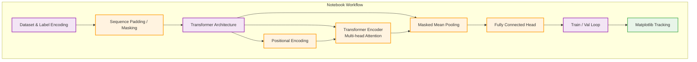

# Transformer Training Notebook (`train_transformer.ipynb`)

This document details the direct pipeline constructed within the `train_transformer.ipynb` Jupyter Notebook. It acts as an experimental testbed specifically for applying Transformer-based classifiers over spatial-temporal sign language landmarks.

---

## 🏗️ Architecture & Component Overview

---

## ⚙️ Detailed Module Breakdown

### 1. The `LandmarkDataset` Class
- **What it does:** Consumes raw `.npy` files from the outputs directory, enumerating subdirectories dynamically to infer sign language classes. Pads or truncates the temporal arrays to adhere to a static sequence stringency (`max_seq_len=15`).
- **Additional Tasks:** Generates and isolates the `label_classes.npy` artifact directly into checkpoints for downstream compatibility and usage by predictive systems.

### 2. SignTransformer Architecture
- **Positional Encoding (`PositionalEncoding`):** Before interacting with attention layers, embeds trigonometric frequencies mapping coordinates onto each positional timestep, ensuring the sequential transformer doesn't lose temporal awareness of when gestures occur.
- **Core Encoder:** Uses a standard `nn.TransformerEncoderLayer` backbone sequence, projecting 1D dimensional limits to `d_model` configurations.
- **Masked Domain Pooling:** Applies precise analytical masking. Instead of naive mean computations on padded zeros, it dynamically determines the valid sequence positional items to mathematically aggregate only explicit and observed landmark events prior to hitting the Linear fully connected layer output.

### 3. Hyperparameters and Scheduler Configurations
- **What it does:** Manages explicit learning environments mapping constants to standard PyTorch devices (`DEVICE`).
- **Learning Rates:** Implements tracking using explicit learning rate schedulers (`ReduceLROnPlateau`). If the validation loss pattern stagnates over sequential epochs, the model shrinks its bounds (`factor=0.5`) to escape local minimas and refine generalizations.

### 4. Interactive Training Loop
- **What it does:** Constructs an iterative epoch evaluation pattern translating batch gradients through the initialized Transformer model layout.
- **Output Interfaces:** Evaluates periodically directly to `stdout`. At completion, uses inline `matplotlib` generation plots displaying Train versus Validation curves tracking accuracy and loss trajectory over evaluated epochs.
