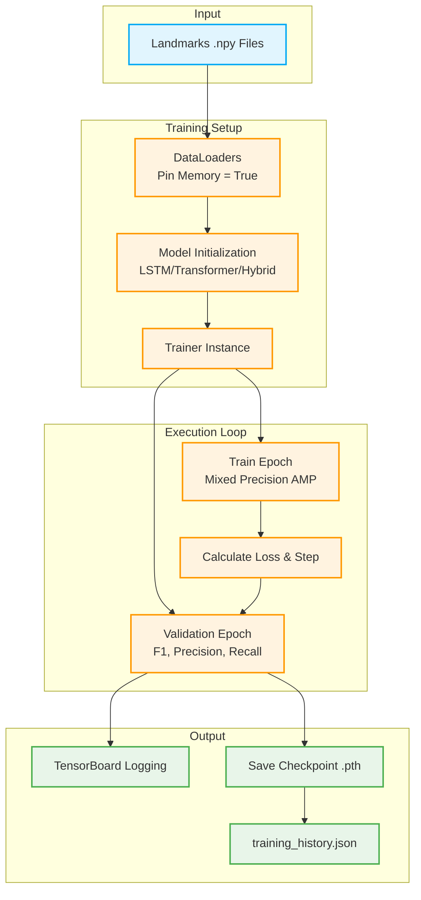

# GPU-Accelerated Training Script (`trainer_current_config-gpu.py`)

This document outlines the training script designed for the Sign Language Recognition project. It focuses on a landmark-only pipeline strictly tuned for GPU acceleration (specifically optimized for memory and speed management on NVIDIA GPUs).

---

## 🏗️ Architecture & Pipeline Overview

---

## ⚙️ Detailed Pipeline Steps

### Step 1: Device Configuration & Optimization
- **What it does:** Automatically detects the best available hardware (CUDA, MPS, or CPU). For CUDA devices, enables `cudnn.benchmark` and high-precision matmul calculations.
- **Why:** Maximizes throughput and ensures compatibility across various environments while providing warning logs for potential VRAM exhaustion.

### Step 2: DataLoader Initialization
- **What it does:** Rebuilds data loaders injected by the dataset module specifically for CUDA. Enables `pin_memory` and sets up `persistent_workers`.
- **Why:** Allows for substantially faster host-to-device dataset transfers during each batch step.

### Step 3: Model Creation
- **What it does:** Dynamically constructs the predictive model architecture (e.g., `lstm`, `transformer`) referencing the extracted dataset shape parameters.
- **Why:** Centralizes the model invocation, permitting modular sweeps over different backbone architectures.

### Step 4: The `Trainer` Application (Core Logic)
- **What it does:** An extensive orchestration class configured with:
    - **Optimizer & Loss:** `AdamW` and `CrossEntropyLoss`.
    - **AMP Scaler:** Automatic Mixed Precision (FP16) on supported hardware for massive processing speedups and memory footprint reduction.
    - **Gradient Accumulation:** Accumulates gradients over multiple steps to simulate larger batch sizes on constrained GPUs.
- **Why:** Abstracts away the complexity of epoch iterations containing verbose gradient tracking, history gathering, and evaluation states.

### Step 5: Metric Tracking and Checkpointing
- **What it does:** Periodically traces train and validation metrics. During validation, generates extended metrics like Precision, Recall, F1-score, and confusion matrices via `scikit-learn`. Results are consistently exported natively to TensorBoard. Upon reaching high-water marks for validation accuracy, it securely drops a `best_model.pth` to disk and saves history dumps.